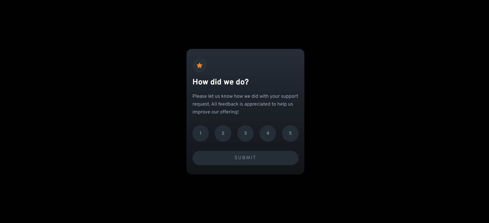
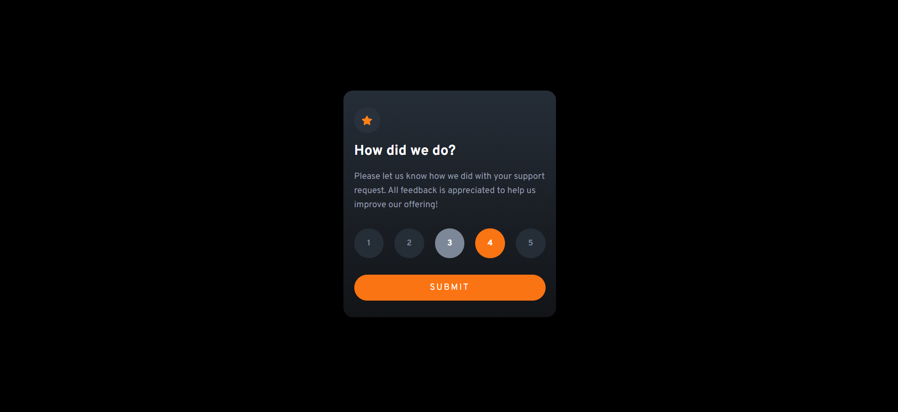
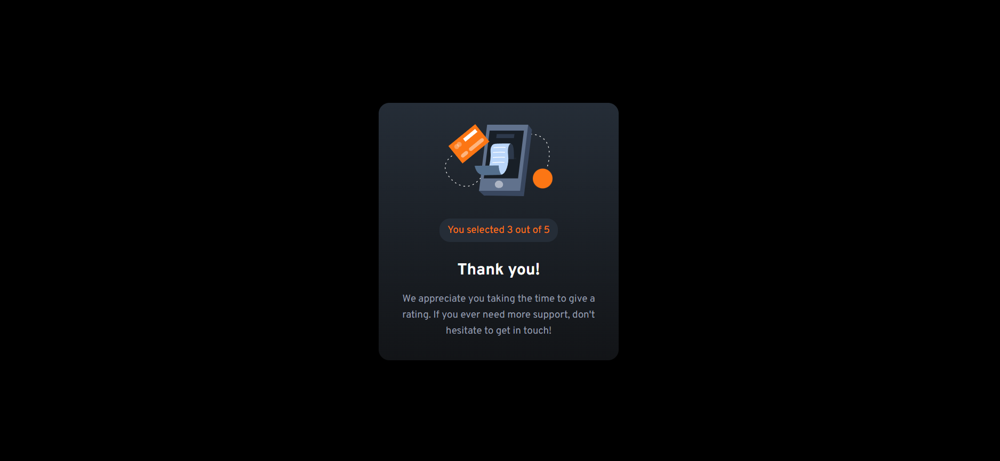
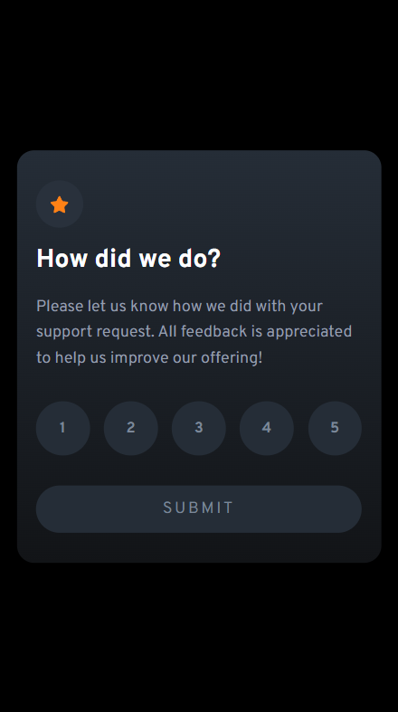
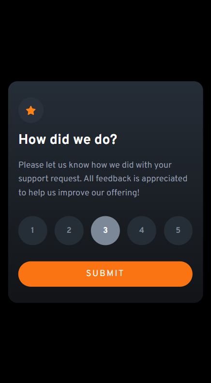
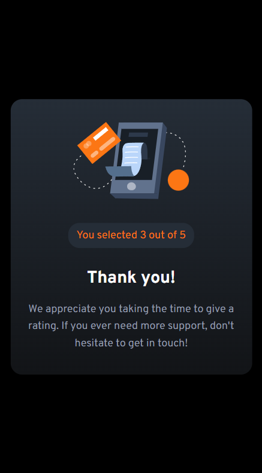

# Frontend Mentor - Interactive rating component solution

This is a solution to the [Interactive rating component challenge on Frontend Mentor](https://www.frontendmentor.io/challenges/interactive-rating-component-koxpeBUmI). Frontend Mentor challenges help you improve your coding skills by building realistic projects.

## Table of contents

- [Overview](#overview)
  - [The challenge](#the-challenge)
  - [Screenshot](#screenshot)
  - [Links](#links)
- [My process](#my-process)
  - [Built with](#built-with)
  - [What I learned](#what-i-learned)
  - [Useful resources](#useful-resources)

## Overview

### The challenge

Users should be able to:

- View the optimal layout for the app depending on their device's screen size
- See hover states for all interactive elements on the page
- Select and submit a number rating
- See the "Thank you" card state after submitting a rating

### Screenshot








### Links

- [Solution](https://github.com/zake-dev/frontendmentor.io/tree/main/interactive-rating-component)
- [Live](https://interactive-rating-component-zake.netlify.app/)

## My process

### Built with

- [React](https://reactjs.org/) - JS library
- [Styled Components](https://styled-components.com/) - For styles
- Flexbox

### What I learned

I put my efforts more on building a `Vite+React` template rather than just implement a component simply. Applied template could be used in any size of projects that suppose to use React library with Vite. Redux with `@reduxjs/toolkit` is chosen to handle global state management library but not used for this project. You can navigate through other pages if you put routes in `react-router-dom`.

One thing I learned from this challenge is how to handle hover style in mobile screens. Hovered style does not work well in touch devices like mobile phone. Sometimes you need to double tap buttons or link on such devices due to hover style or hover-triggered events.

To avoid hover errors in touch devices, we can easily restrict hover-related styles to be applied only for non-touch devices by using media query.

```css
@media (hover: hover) {
  ... styles for devices that have 'hover';
}

@media (hover: none) {
  ... styles for touch devices;
}
```

### Useful resources

- [How to Remove Hover on Touch Devices](https://webdevpuneet.com/how-to-remove-hover-on-touch-devices/#gsc.tab=0)
