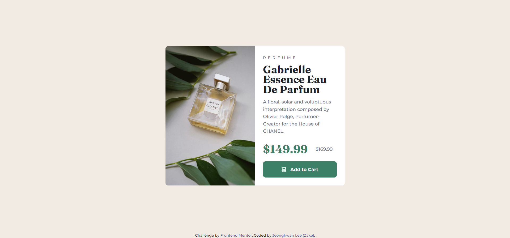

# Frontend Mentor - Product preview card component solution

This is a solution to the [Product preview card component challenge on Frontend Mentor](https://www.frontendmentor.io/challenges/product-preview-card-component-GO7UmttRfa). Frontend Mentor challenges help you improve your coding skills by building realistic projects.

## Table of contents

- [Overview](#overview)
  - [The challenge](#the-challenge)
  - [Screenshot](#screenshot)
  - [Links](#links)
- [My process](#my-process)
  - [Built with](#built-with)
  - [What I learned](#what-i-learned)
  - [Continued development](#continued-development)
  - [Useful resources](#useful-resources)

## Overview

### The challenge

Users should be able to:

- View the optimal layout depending on their device's screen size
- See hover and focus states for interactive elements

### Screenshot




### Links

- [Solution](https://github.com/zake-dev/frontendmentor.io/tree/main/product-preview-card-component)
- [Live](https://product-preview-card-component-zake.netlify.app)

## My process

### Built with

- Semantic HTML5 markup
- CSS custom properties
- Flexbox
- Mobile-first workflow

### What I learned

Generally, I use to build an app with React, SCSS, CSS-in-JS to styling UI components. However, in this challenge I only used Semantic HTML with pure CSS, BEM naming convention. Nested syntax in SCSS is way more concise than normal syntax in terms of separation of concerns, and readability. If this challenge requires multiple components with interactions, I would've used React.

Handling responsive design was a bit hard as the given design files are JPG format instead of Figma or other design tools. I had to guess how much the font size is big, or what padding size is used for the design. Those took a while than other tasks.

Despite of above, this challenge was helpful to me. I learned how to manage different size of images based on screen size, using `<picture>` tag. Without using `@media` query in CSS, `<source>` tag and `` tag combined in `<picture>` tag makes you handle proper size of images based on screen size.

```html
<picture>
  <source srcset="/path/to/alt/image" media="(min-width: 568px)" />
  
</picture>
```

### Continued development

It makes me feel still uncomfortable to manage responsive design. I used to develop a Desktop-first website or Mobile-first website not for both. I believe future challenges will improve my skills on handling responsive design.

### Useful resources

- [\<picture\> MDN doc](https://developer.mozilla.org/en-US/docs/Web/HTML/Element/picture)
- [Using media queries - MDN](https://developer.mozilla.org/en-US/docs/Web/CSS/Media_Queries/Using_media_queries)
