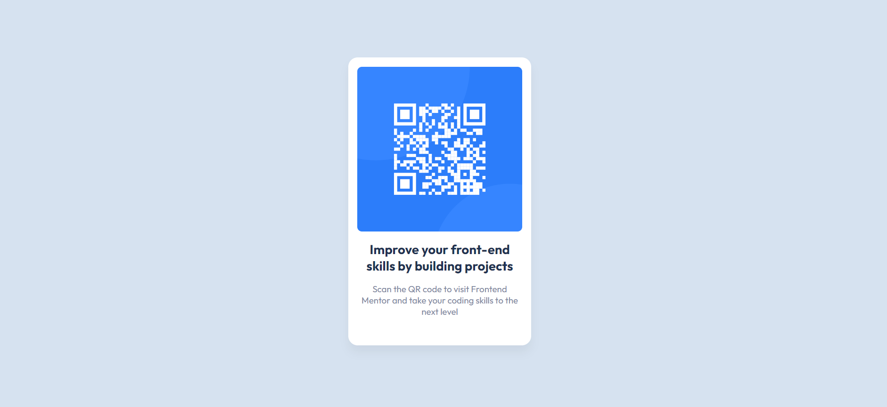

# Frontend Mentor - QR code component solution

This is a solution to the [QR code component challenge on Frontend Mentor](https://www.frontendmentor.io/challenges/qr-code-component-iux_sIO_H). Frontend Mentor challenges help you improve your coding skills by building realistic projects.

## Table of contents

- [Overview](#overview)
  - [Screenshot](#screenshot)
  - [Links](#links)
- [My process](#my-process)
  - [Built with](#built-with)
  - [What I learned](#what-i-learned)

## Overview

### Screenshot

### Links

- [Solution](https://github.com/zake-dev/frontendmentor.io/tree/main/qr-code-component)
- [Live](qr-code-component-zake.netlify.app)

## My process

### Built with

- Semantic HTML5 markup
- CSS custom properties
- Flexbox

### What I learned

Nothing really learned from this challenge. This is a very simple design implementation challenge without any responsive elements. It took less than 10 minutes to complete.
